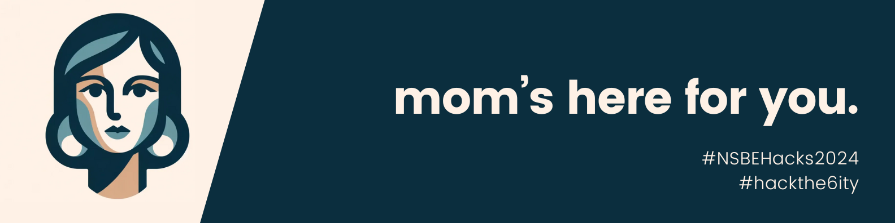

# My Only Manager (MOM) – NSBEHacks 2024 

**Hackathon's Theme:** Reimagine the cities in Canada to provide innovative and sustainable solutions to the challenges faced by today's youth

**Project Description:** Meet your new MOM! MOM is an AI-integrated productivity Telegram chatbot that significantly reduces the hassle of managing your tasks manually! With a touch of Python, we have created one of the first AI assistant that allows you to make time-sensitive inquiries. With a multithreading approach, you can ask MOM to remind you of your tasks at a certain time or duration, let her know what other tasks you have left, and enjoy `co.chat()` in many more ways!

**Our Group:** [Gwendolyn Kwong](https://github.com/ggykwong), [Seongmin Chang](https://github.com/takeachangs), [Serzio Perez](https://github.com/SoySerhio507)

**Submission:** [Devpost]()

**To Run MOM:**

1. Download and install Telegram.
2. Add [MOM](https://t.me/MomNSBEbot) to your Telegram. 
3. Python install all the required python libraries and packages found in "requirements.txt".
4. Run main.py.

